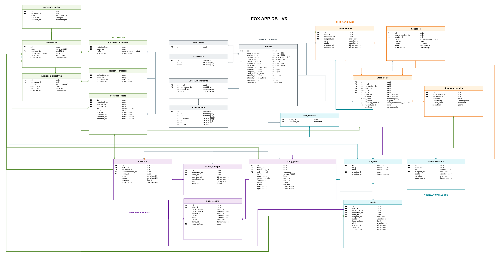

# Base de datos

## Contenido

- [Diagrama](#diagrama)
- [Modelo de autorización](#modelo-de-autorización)
- [Enums](#enums)
- [Tablas por dominio](#tablas-por-dominio)
  - [Identidad y perfil](#identidad-y-perfil)
  - [Notebooks (cuadernos)](#notebooks-cuadernos)
  - [Chat y archivos](#chat-y-archivos)
  - [Material y planes](#material-y-planes)
  - [Agenda y catálogos](#agenda-y-catálogos)
- [Convenciones del esquema](#convenciones-del-esquema)
- [Vista usage](#vista-usage)
- [Extensiones y funciones](#extensiones-y-funciones)

## Diagrama

## Modelo de autorización

> [!IMPORTANT]
> La RLS está **habilitada sin ninguna policy** en todas las tablas, a propósito:
> cierra el acceso directo por PostgREST. El backend se conecta con la service key
> (bypass de RLS), así que **la autorización vive en el código Go**, no en la base.
> Cada consulta filtra por `user_id` o por membresía. Nunca uses `FORCE ROW LEVEL
> SECURITY`. Detalle en [../architecture.md](../architecture.md#el-modelo-de-seguridad).

## Enums

| Enum | Valores |
|---|---|
| `system_role` | `user`, `admin`, `auditor` |
| `user_kind` | `student`, `teacher`, `professional` |
| `member_role` | `owner`, `member` |
| `message_role` | `user`, `assistant`, `system` |
| `processing_status` | `pending`, `ready`, `failed` |

Otras listas cerradas van como `CHECK` sobre una columna `varchar` (p. ej.
`academic_level`, `materials.type`, `events.kind`).

## Tablas por dominio

### Identidad y perfil

| Tabla | Qué guarda |
|---|---|
| `auth.users` | Usuarios de Supabase Auth (externa). `profiles.id` la referencia. |
| `profiles` | Una fila por usuario de Auth, creada por trigger. Perfil, racha, `preferences` y `custom_instructions`. |
| `professions` | Catálogo de profesiones. |
| `achievements` | Catálogo de logros. |
| `user_achievements` | Logros desbloqueados por usuario. La fila existe = desbloqueado; `seen_at` NULL = falta notificar. |

> [!NOTE]
> `profiles.id` es el mismo UUID que `auth.users.id`: borrar el usuario de Auth
> hace cascada a todo lo suyo. La racha (`current_streak`) es caché reconstruible
> desde `study_sessions`.

### Notebooks (cuadernos)

| Tabla | Qué guarda |
|---|---|
| `notebooks` | Cuaderno personal o colaborativo. `join_code` (NULL = no se puede unir). |
| `notebook_members` | Acceso al cuaderno. **Única fuente de verdad del acceso**; `owner` es el creador. |
| `notebook_topics` | Temario del cuaderno (contenido, no objetivos). |
| `notebook_objectives` | Objetivos del cuaderno. |
| `objective_progress` | Progreso por usuario sobre un objetivo (0–100). |
| `notebook_posts` | Muro: `anuncio`, `tarea` o `material`. `parent_id` = comentario. Borrado suave (`deleted_at`). |

### Chat y archivos

| Tabla | Qué guarda |
|---|---|
| `conversations` | Hilo `ai` (con el modelo) o `group` (entre miembros). Personal si `notebook_id` NULL. |
| `messages` | Mensajes. `sender_id` NULL = generado por la IA. `saved` = guardado por el usuario; `mode` viaja al prompt. |
| `attachments` | Archivo subido a Storage. `processing_status`, `extracted_text`. Se cuelga de una conversación, mensaje, post o plan. |
| `document_chunks` | Fragmentos del texto extraído + `embedding vector(1536)` para la búsqueda RAG. |

> [!WARNING]
> `document_chunks.embedding` es `vector(1536)`, atado a `EMBEDDING_DIM` y a un
> índice HNSW (coseno). Cambiar el modelo de embeddings obliga a recrear la
> columna con su índice y reprocesar todos los adjuntos.

### Material y planes

| Tabla | Qué guarda |
|---|---|
| `materials` | Material generado por IA; `content` es un `jsonb` que se lee y escribe entero. `type` acotado por `CHECK`. |
| `exam_attempts` | Un intento de examen (o una entrega de tarea). `submitted_at` NULL = en curso. |
| `study_plans` | Plan de estudio para un examen; la IA arma el esqueleto desde el material. |
| `plan_lessons` | Lecciones ordenadas del plan. El contenido (`material_id`) se genera al abrir la lección. |

### Agenda y catálogos

| Tabla | Qué guarda |
|---|---|
| `subjects` | Materias. `created_by` NULL = catálogo global; con valor = privada de ese usuario. |
| `user_subjects` | Materias que sigue un usuario. |
| `study_sessions` | Bitácora de actividad. Alimenta la pantalla de actividad, la racha, focus y logros. |
| `events` | Calendario del usuario. Sin recurrencia: una clase semanal es una fila por semana. |

## Convenciones del esquema

| Convención | Detalle |
|---|---|
| Borrado en cascada vs. `SET NULL` | Borrar un perfil arrastra todo lo suyo; borrar un cuaderno deja el material y las conversaciones del autor con `notebook_id = NULL`, no los borra. |
| 404 en vez de 403 | La autorización filtra por usuario en Go; un recurso ajeno no aparece, no revela que existe. |
| Borrado suave | Solo `notebook_posts` (`deleted_at`); el resto se borra de verdad. |
| Un intento abierto | `uq_attempt_open`: como mucho un `exam_attempts` sin `submitted_at` por examen y usuario. |
| Materias sin duplicar | Índices únicos sobre `norm(name)`: uno global (`created_by` NULL) y uno por usuario. |
| Sin recurrencia ni TTS/vídeo | `events` no repite; `materials.type` no incluye podcast ni vídeo (no hay pipeline). |

## Vista usage

`usage` es una **vista**, no una tabla: cuenta uso diario por usuario (preguntas,
materiales, adjuntos y bytes) sobre lo ya almacenado. No añade ninguna ruta de
escritura.

## Extensiones y funciones

| Objeto | Para qué |
|---|---|
| `vector` (pgvector) | La columna `document_chunks.embedding` y su índice HNSW. |
| `unaccent` | Búsqueda insensible a acentos. |
| `norm(text)` | Envuelve `lower(unaccent(...))` como `IMMUTABLE` para poder indexarla (unaccent sola no lo es). |
| Trigger `touch_updated_at` | Mantiene `updated_at` en `notebook_posts` y `study_plans`. |
| Trigger `on_auth_user_created` | Crea la fila de `profiles` al registrarse un usuario en Auth. |
